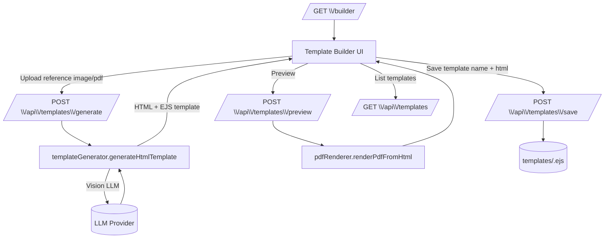

## Invoice Agent

AI-powered invoice extraction + standardization with **downloadable Excel** and **pixel-perfect PDF generation**.

- **Upload & extract** invoice data (PDF / image).
- **Enrich** the extracted JSON (amount-in-words, tax derivations).
- **Generate outputs**
  - Default Excel template (`templates/default_template.xlsx`)
  - User-provided Excel template (label-based fill)
  - AI-read “form image” → dynamic Excel layout fill
  - AI-generated **EJS + Puppeteer** templates → pixel-perfect PDF invoices
- **Switch models at runtime** (UI + API) with **Google** and **NVIDIA** providers.

---

### Top-level architecture (how it works)

```mermaid
flowchart TD
  U[User (Browser UI)] -->|Upload invoice| UI[/GET \\/ (Upload Page)/]
  UI -->|POST multipart/form-data| P[/POST \\/api\\/invoice\\/process/]

  P -->|Store temp files| UP[(uploads/)]
  P --> FH[fileHandler.prepareForLLM]
  FH -->|PDF w/ text| TXT[PDF text extraction]
  FH -->|Image or scanned PDF| IMG[Convert to image data URI]

  TXT --> EX[extractor.extractInvoice]
  IMG --> EX

  EX -->|LLM invoke + JSON repair passes| LLM[(LLM Provider)]
  LLM --> EX
  EX -->|Raw JSON| EN[enricher.enrichInvoiceData]

  EN --> CHOOSE{Output path}
  CHOOSE -->|template_name provided| PDF[pdfTemplater.generateInvoicePdf]
  PDF --> PR[pdfRenderer (Puppeteer)]
  PR --> OUTPDF[(outputs/invoice_<id>.pdf)]

  CHOOSE -->|form_image is .xlsx| X1[filler.fillExcelTemplate]
  X1 --> OUTXLS[(outputs/invoice_<id>.xlsx)]

  CHOOSE -->|form_image is image/pdf| TR[templateReader.readTemplateImage]
  TR --> X2[filler.fillDynamicTemplate]
  X2 --> OUTXLS

  CHOOSE -->|no template_name, no form_image| X0[filler.fillDefaultTemplate]
  X0 --> OUTXLS

  EN --> JSON[(outputs/invoice_<id>.json)]
  OUTXLS --> DL[/GET \\/api\\/invoice\\/:id\\/download/]
  OUTPDF --> DL
```

---

### Product flows

#### 1) Invoice processing flow

1. Upload invoice on `/` (field name **`raw_invoice`**).
2. Server decides:
   - **Text PDF** → extract PDF text → LLM reads text
   - **Image / scanned PDF** → render/encode image → vision-capable LLM reads image
3. Parsed JSON is validated/“repaired” with multiple parse passes.
4. Data is **enriched** (amount-in-words, SGST/CGST/IGST derivations).
5. Output is generated:
   - **PDF** if `template_name` is selected (EJS template → Puppeteer → PDF)
   - Otherwise **Excel** via default, user Excel, or dynamic AI-read form structure
6. Outputs are written under `outputs/` and the uploaded files are cleaned up.

#### 2) Template Builder flow (pixel-perfect PDF templates)



You can then select that saved template on the main upload page and the pipeline will output a **PDF**.

#### 3) Provider/model settings flow

- UI: `/settings`
- API:
  - `GET /api/config/providers` (current + available providers)
  - `POST /api/config/set` (switch provider/model at runtime)
  - `POST /api/config/test` (sanity test API key + model)

---

### Routes and endpoints

- **Pages**
  - `GET /` upload UI
  - `GET /builder` template builder UI
  - `GET /settings` provider/model UI
  - `GET /result/:id` results UI (download + preview)

- **Invoice API**
  - `POST /api/invoice/process` (multipart form-data: `raw_invoice` + optional `form_image` + optional `template_name`)
  - `GET /api/invoice/:id` fetch stored JSON
  - `GET /api/invoice/:id/download` download `.xlsx` or `.pdf`
  - `GET /api/invoice/:id/pdf` inline PDF preview (if PDF output exists)
  - `GET /api/invoice/formats/supported` list accepted formats

- **Templates API**
  - `POST /api/templates/generate` (upload `reference_image`, returns HTML/EJS)
  - `POST /api/templates/preview` (HTML → PDF buffer)
  - `POST /api/templates/save` (save `.ejs` under `templates/`)
  - `GET /api/templates` list saved templates

---

### Folder structure (what to look at)

- **Server entry**
  - `index.js` Express app, routes, middleware
- **Routes**
  - `routes/invoice.js` main processing endpoint + downloads
  - `routes/templates.js` template builder APIs
  - `routes/config.js` provider/model switching + test
  - `routes/views.js` page routing
- **Core services**
  - `services/extractor.js` LLM extraction pipeline + JSON repair passes
  - `services/fileHandler.js` PDF text extract + scanned PDF → image
  - `services/enricher.js` derived fields (words, GST splits)
  - `services/filler.js` Excel filling (default, dynamic, or user Excel)
  - `services/templateReader.js` vision → “form structure” JSON
  - `services/templateGenerator.js` vision → pixel-perfect HTML/EJS template
  - `services/pdfTemplater.js` normalizes extracted JSON → EJS variables + writes PDF
  - `services/pdfRenderer.js` Puppeteer render (EJS/HTML → PDF)
  - `services/llm.js` LLM provider wrapper (Google + NVIDIA)
- **Templates**
  - `templates/*.ejs` saved PDF templates
  - `templates/default_template.xlsx` default Excel output template
- **Outputs**
  - `outputs/` generated PDFs/XLSX/JSON (gitignored)
- **Uploads**
  - `uploads/` temporary upload storage (gitignored)
- **Schema**
  - `schema/invoiceSchema.json` extraction schema embedded in the LLM prompt

---

### Environment variables

Set these locally in `.env` (do **not** commit secrets) or in your deployment provider’s dashboard.

- **Required**
  - `GOOGLE_API_KEY`
  - `NVIDIA_API_KEY`
- **Runtime selection**
  - `ACTIVE_PROVIDER` = `google` or `nvidia`
  - `ACTIVE_MODEL` = provider model name (examples below)
- **Server**
  - `PORT` (optional locally; Render provides this automatically)
  - `MAX_FILE_SIZE_MB` (default 10)

Example:

```bash
GOOGLE_API_KEY=...
NVIDIA_API_KEY=...
ACTIVE_PROVIDER=google
ACTIVE_MODEL=gemini-2.5-flash
MAX_FILE_SIZE_MB=10
```

---

### Run locally

```bash
npm install
npm start
```

Open:
- `http://localhost:3000/`
- `http://localhost:3000/builder`
- `http://localhost:3000/settings`

---

### Deploy (Render)

This project is a long-running Express server + Puppeteer, so a container/web-service host like Render is a good fit.

- **Build command**: `npm install`
- **Start command**: `npm start`
- **Environment**: set `GOOGLE_API_KEY`, `NVIDIA_API_KEY`, `ACTIVE_PROVIDER`, `ACTIVE_MODEL`, `MAX_FILE_SIZE_MB`
- **Port**: no changes required; the app listens on `process.env.PORT`

Notes:
- Free instances can be slow to start and can sleep when idle.
- `outputs/` and `uploads/` are on the instance filesystem; treat them as **ephemeral** unless you add persistent storage.

---

### Operational notes / gotchas

- **Vision vs text invoices**
  - Text-based PDFs use PDF text extraction.
  - Scanned PDFs and images require a **vision-capable model** (the app will warn if the selected model doesn’t support vision).
- **Template Builder requires vision**
  - `/builder` generates pixel-perfect HTML by “looking at” the invoice image/PDF.
- **Puppeteer**
  - PDF generation uses Puppeteer with `--no-sandbox` flags (common for cloud deployments).

